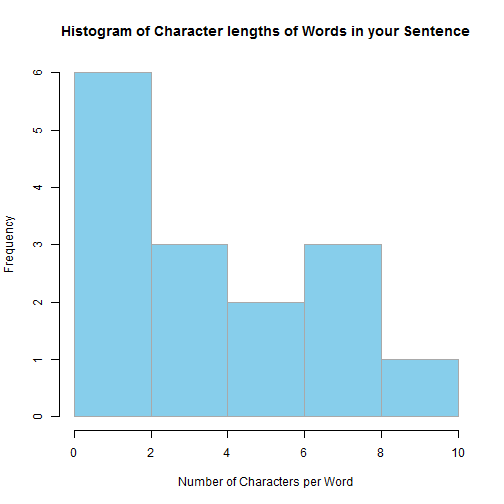

---
title       : Reproducible Pitch Presentation
subtitle    : An explanation of the Shiny Sentence Reversal and Analysis Application
author      : rgdk
job         : 
framework   : io2012        # {io2012, html5slides, shower, dzslides, ...}
highlighter : highlight.js  # {highlight.js, prettify, highlight}
hitheme     : hemisu-light      # tomorrow swiss
widgets     : [bootstrap]            # {mathjax, quiz, bootstrap}
mode        : selfcontained # {standalone, draft}
knit        : slidify::knit2slides
--- .class #id 

## Introduction 


The Shiny Sentence Reversal and Analysis application is a prime example of what can be achieved with the shiny framework.

With only a few short lines of code, a **fully functional** R-capable application was written. It is hosted by **shinyapps.io** allowing the application to be published to the web and therefore be publicly available.

--- .class #id 

## What Can The Application Do?


* Accept user input in the form of a sentence typed into a text area.
* Reverse the characters comprising the entered sentence and display this reversed version.
* Create and display a histogram that dynamically describes the frequency of word lengths in the sentence that was entered.


To access the app, go to: https://rgdk.shinyapps.io/shinyProject

--- .class #id 

## Sentence Reversal Code

Here is a sample of the sentence reversal code used in the shiny application. 

Notice how this function is simplified into a single line of code only!


```r
library(stringr)

#set up the sample sentence
sampleSentence <- 
  "This is an example sentence with a number of words with various character in it"

#reverse the sentence
strsplit(sapply(lapply(strsplit(sampleSentence, NULL), rev), paste, collapse=""),'\n')
```

```
## [[1]]
## [1] "ti ni retcarahc suoirav htiw sdrow fo rebmun a htiw ecnetnes elpmaxe na si sihT"
```

--- .class #id 

## Displaying the Histogram

 

Notice that here the code to generate the histogram has been suppressed.

